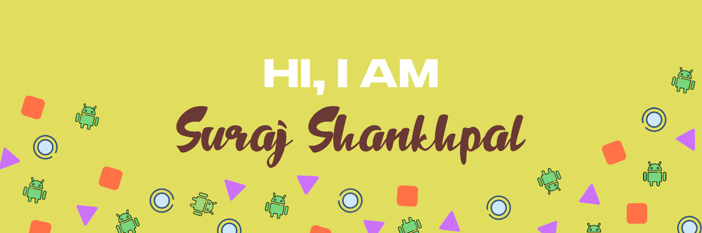

<h1 align="center">Hi 👋, I'm Suraj Shankhpal</h1>

###

###

🌱 I’m currently working on: My Personal Portfolio.  👯 I’m looking to collaborate on: Any projects!  🧐 I’m currently learning: Python Flask.  💬 Ask me about: Anything you'd like to know.  ⚡ Fun fact: I can work and complete any project without prior knowledge of the language (thanks to AI!).

###

  
  
  
  

###

  
  
  
  
  
  
  
  
  
  
  
  
  
  
  
  
  
  
  
  
  

###

  
  

<picture>
  <source media="(prefers-color-scheme: dark)" srcset="github-user-contribution.svg" />
  <source media="(prefers-color-scheme: light)" srcset="github-user-contribution-light.svg" />
  
</picture>

###

  

###
